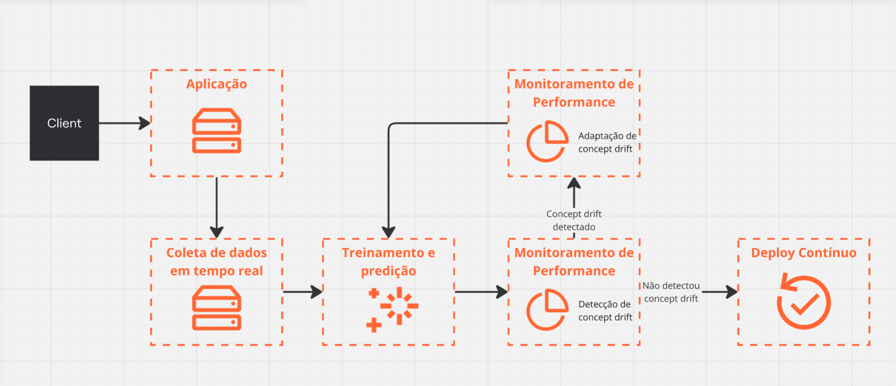
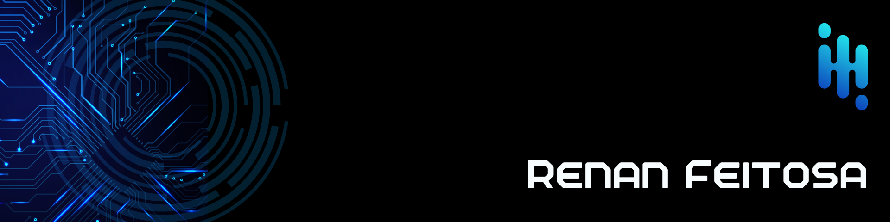

  

## Introdução

&emsp;&emsp; O aprendizado de máquina tem se mostrado uma ferramenta poderosa para a construção de sistemas conversacionais, como chatbots e assistentes virtuais. No entanto, um desafio significativo enfrentado por esses modelos é sua incapacidade de se adaptar continuamente a novos dados após o treinamento inicial. 

&emsp;&emsp; Quando os modelos não são atualizados regularmente, eles tendem a se desatualizar à medida que o contexto ao seu redor muda, impactando negativamente sua performance. Novas informações, mudanças nos padrões de comportamento dos usuários e o surgimento de novos tópicos não são incorporados, levando a uma gradual deterioração da precisão das respostas geradas.

&emsp;&emsp; Esse fenômeno é amplamente descrito pelo conceito de concept drift, que ocorre quando as distribuições dos dados mudam ao longo do tempo. Quando não tratado, resulta na perda de relevância e eficácia dos modelos. Em sistemas conversacionais, o impacto disso é significativo: as interações com os usuários tornam-se menos precisas, com respostas incorretas ou irrelevantes, comprometendo a qualidade da experiência e a confiança no sistema.

## Desenvolvimento

### Problemática da não atualização do modelo

&emsp;&emsp; Sistemas conversacionais, como chatbots e assistentes virtuais, dependem fortemente de modelos de aprendizado de máquina para interpretar e gerar respostas adequadas. No entanto, uma limitação significativa desses modelos é a sua incapacidade de incorporar novas informações de maneira contínua, o que resulta em um acúmulo de dados desatualizados ao longo do tempo [[3]](#referências-bibliográficas). 

&emsp;&emsp; O conhecimento armazenado nos modelos é estático após o pré-treinamento, o que significa que mudanças no mundo, como novas descobertas científicas ou acontecimentos sociais, não são refletidas nas respostas geradas por esses sistemas. Isso resulta em uma deterioração da precisão e relevância das respostas com o tempo, uma vez que os padrões de linguagem, preferências dos usuários e contextos mudam constantemente.

### Paradigma da Aprendizagem Contínua

&emsp;&emsp; O paradigma do aprendizado contínuo representa uma evolução importante para sistemas de aprendizado de máquina, particularmente em domínios onde a distribuição dos dados está em constante mudança. Tradicionalmente, o aprendizado de máquina tem sido aplicado a problemas estáticos, onde o conjunto de dados é fixo e as relações entre atributos permanecem constantes. No entanto, muitos problemas do mundo real envolvem dados temporais ou contextos que mudam ao longo do tempo, o que demanda uma adaptação constante do modelo. Esse cenário é amplamente reconhecido no estudo do concept drift, que descreve a alteração dos padrões de dados e das distribuições subjacentes ao longo do tempo.[[2]](#referências-bibliográficas)

&emsp;&emsp;  No contexto de sistemas conversacionais, o concept drift pode se manifestar em novas formas de comunicação, gírias, mudanças no comportamento do usuário ou novos tópicos de interesse. Isso torna essencial a implementação de mecanismos que permitam ao modelo identificar e se ajustar a essas mudanças.

### Impacto em Sistemas Conversacionais

&emsp;&emsp; Em sistemas conversacionais, a capacidade de um modelo responder com precisão a perguntas e interagir de forma relevante com os usuários depende diretamente da atualização contínua do conhecimento armazenado. A falta de um mecanismo de aprendizagem contínua impacta negativamente a qualidade das interações, pois o modelo passa a fornecer respostas obsoletas ou incorretas, além de poder não compreender novos dialetos, comprometendo a experiência do usuário e reduzindo a confiança no sistema.

### Solução Proposta

&emsp;&emsp; Para lidar com o concept drift em sistemas conversacionais, propõe-se um sistema de aprendizado contínuo que integra os seguintes componentes:

  Imagem 1 - Diagrama de aprendizado contínuo em sistemas conversacionais
  
  Fonte: Produzido pelo autor (2024)

 

**Coleta de Dados em Tempo Real**

&emsp;&emsp; Os dados provenientes das interações dos usuários - comunicação entre o client e a aplicação - são continuamente coletados e armazenados para análise e re-treinamento do modelo. Este é um passo crítico para a identificação de concept drift. A coleta de dados pode incluir logs de conversas, feedback de usuários, e atributos adicionais (como contexto e metadados).

 

**Treinamento e Predição**

&emsp;&emsp; Este componente realiza o treinamento e a predição utilizando algoritmos de Machine Learning ou modelos de Deep Learning. Aqui, o sistema pode adotar aprendizado incremental, ou seja, atualizar o modelo à medida que novos dados chegam, sem a necessidade de treinar um modelo inteiro do zero. Algoritmos como SGD, Online SVM, e Naive Bayes Incremental são exemplos de abordagens que suportam aprendizado contínuo.

**Monitoramento de Performance (Detecção de Concept Drift)**

&emsp;&emsp; Este componente avalia o desempenho do modelo em tempo real e detecta o concept drift. Existem diferentes tipos de drift (súbito, gradual, recursivo)[[1]](#referências-bibliográficas), e cada um pode exigir abordagens diferentes para detecção. Entre eles, é possível citar:
  - **DDM (Drift Detection Method)**, **EDDM (Early Drift Detection Method)**: Métodos baseados em estatísticas de erro, onde o aumento de erro em uma sequência de predições sinaliza um drift.
  - **ADWIN**: Um algoritmo adaptativo de janela que detecta mudanças em streams de dados.

&emsp;&emsp; Tendo detectado o concept drift, o sistema pode acionar o re-treinamento incremental do modelo para se adaptar às novas condições.

 

**Monitoramento de Performance (Adaptação ao Concept Drift)**

&emsp;&emsp; Se o concept drift for detectado, esta etapa realiza a adaptação do modelo utilizando os dados mais recentes coletados. O treinamento incremental é acionado, ajustando os pesos do modelo conforme as novas entradas.

&emsp;&emsp; No treinamento incremental, os pesos do modelo (por exemplo, em uma rede neural) são ajustados de maneira que novos padrões sejam incorporados. O aprendizado acontece de forma que as novas amostras recebam um peso maior no processo de ajuste, enquanto informações antigas que ainda são válidas não são totalmente descartadas.

&emsp;&emsp; Uma das preocupações com o treinamento incremental é o fenômeno conhecido como "esquecimento catastrófico", onde o modelo perde completamente o conhecimento anterior ao incorporar novas informações. Para mitigar isso, técnicas como regularização, ensaios (rehearsal), e expansão de parâmetros podem ser usadas. Essas abordagens tentam equilibrar o aprendizado de novas informações com a retenção de conhecimento antigo.

 

**Deploy Contínuo**

&emsp;&emsp; Após o ajuste do modelo, o novo modelo treinado é implantado automaticamente na aplicação. O deploy realizado de forma contínua não interrompe o fluxo de interações com os usuários ao mesmo tempo que garante a atualização do modelo.

 

## Conclusão

&emsp;&emsp; A proposta de incorporar aprendizado contínuo em sistemas conversacionais é uma evolução necessária para enfrentar as constantes mudanças no ambiente de dados. Ao integrar técnicas que permitam a detecção e adaptação ao concept drift, como o treinamento incremental e a coleta contínua de dados, espera-se melhorar a precisão e relevância das interações com os usuários. No entanto, a implementação desse paradigma traz desafios, como a complexidade no monitoramento de desempenho, a necessidade de balancear o aprendizado de novos padrões com a preservação do conhecimento antigo e o cuidado em evitar o fenômeno do esquecimento catastrófico.

&emsp;&emsp; Além disso, o esforço necessário para implementar um sistema de aprendizado contínuo é considerável, envolvendo a integração de novas arquiteturas, algoritmos e pipelines de deploy contínuo. Entretanto, os benefícios em termos de manutenção de relevância, precisão e capacidade de resposta a mudanças justificam os esforços e recursos empregados. O desenvolvimento de sistemas adaptáveis permitirá que os chatbots e assistentes virtuais se mantenham úteis e eficazes ao longo do tempo, mesmo em face de alterações dinâmicas nos padrões de dados e comportamentos dos usuários.

## Referências Bibliográficas

1. BERTAN, Erica. Medium. Medium. Disponível em: <https://medium.com/@ericabertan/o-que-é-concept-drift-em-machine-learning-40ae3c4f0b67>. Acesso em: 16 set. 2024.

2. HARRIES, Michael ;  HORN, Kim. Detecting Concept Drift in Financial Time Series Prediction Using Symbolic Machine Learning. World Scientific Publishing, p. 91–98, 1995.

3. JANG, Joel; YE, Seonghyeon; YANG, Sohee; et al. Towards Continual Knowledge Learning of Language Models. [s.l.: s.n.], 2022. Disponível em: <https://arxiv.org/pdf/2110.03215>. Acesso em: 15 set. 2024.

 

  

